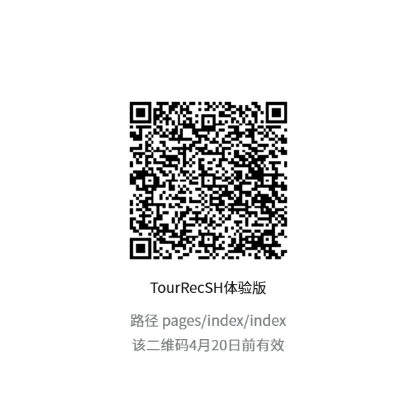

# Shanghai Tourist Attraction Recommendation Mini Program

A WeChat mini program that helps visitors discover popular attractions in Shanghai. Features include real-time attraction data from Amap API, tag-based filtering, search, map navigation, and nearby recommendations (hotels, restaurants, subway, trendy spots).

## Features

- **Attraction List** – 20+ curated Shanghai attractions with high-quality images
- **Tag Filtering** – Filter by historical sites, night views, family-friendly, shopping, etc.
- **Real-time Search** – Search attractions by name
- **Detail Page** – Full description, photo, and buttons for map & nearby
- **Map Navigation** – Built-in route planning via WeChat map
- **Nearby Recommendations** – Discover nearby POIs using Amap API
- **Fallback Mechanism** – Local data backup when network fails

## Tech Stack

- WeChat Mini Program (WXML, WXSS, JavaScript)
- Amap API (static map, place search, around search)
- Cursor (AI-assisted development)
- Git (version control)

## Demo Video

[Click here to watch the demo video](你的视频链接)

## Trial Version

Scan the QR code below to try the mini program on WeChat. *Note: Due to WeChat restrictions, you need to be added as a tester. Please contact me at [cecilia050102@163.com] and I will add your WeChat ID.*

  <!-- 如果你有二维码截图，放到 images 文件夹，然后这行取消注释 -->

## Project Structure
